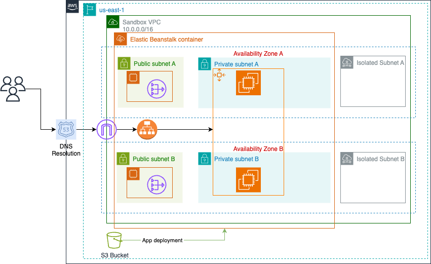

# Підготовка
Для розгортання проєкту вам знадобляться такі інструменти:
* Node.js
* AWS CLI
* Облікові дані AWS

#### Step 1 - Verify environment
Ви можете перевірити, чи готове ваше середовище, за допомогою `make check`

#### Step 2 - Install Node.js dependencies
Код написаний на TypeScript, тому необхідно встановити модулі за допомогою `make install`

#### Step 3 - Prepare AWS environment
Для виконання розгортань необхідно створити додаткові ресурси в AWS за допомогою `make bootstrap`

# Розгортання
Код, що описує інфраструктуру, знаходиться у папці `cloud/`, тому для розгортання перейдіть до цієї папки.

## Інфраструктура
Для створення ресурсів із попереднього перегляду необхідно розгорнути два стекі.

#### Стек  1 - Sandbox
Цей стек за задумом має включати спільні ресурси (наприклад, ті, що використовуються іншими стеками). За замовчуванням версія включає VPC та ресурси, необхідні для його функціонування.

#### Стек  2 - App
Цей стек є середовищем Elastic Beanstalk, де буде розгорнуто додаток, а також інші необхідні ресурси (такі як ролі) для його функціонування.

Для обох стеків ви можете переглянути список ресурсів за допомогою `npm run cdk diff StackName`. Щоб створити ресурси в AWS, запустіть `npm run cdk deploy StackName` і підтвердьте зміни ролей/дозволів.

## Проект
Щоб розгорнути поточну версію додатка в Elastic Beanstalk, запустіть `npm run deploy-version App`. Це виконає такі дії:
1. Підготує *.zip із файлами проєкту
2. Замінить версію в AWS
3. Розгорне нову версію у середовищі

# Видалення
Після завершення роботи *завжди* видаляйте ресурси у такому порядку:
```
npm run cdk destroy App
npm run cdk destroy Sandbox
```

# Як запустити проект

Рекомендовано використовувати Докер, хоча можете спробувати і без нього

Докер для macOS

1. Встановіть `Docker` та `mutagen-compose`
2. Завантажте проект і запустіть контейнери
```shell
  git clone git@github.com:bpohoriletz/prototype.git
  cd prototype/.devcontainer
  mutagen-compose up -d --build
```
3. Запустіть сервер
```shell
  docker ps
9046ae8a6027   dev-db-ruby-3.1.x-rails-7.x.x    "docker-entrypoint.s…" 5 hours ago   Up 5 hours   0.0.0.0:54321->5432/tcp   prototype-prototype_development-1
542d101a168c   ruby-3.1.x-rails-x.x.x           "sleep infinity"       5 hours ago   Up 5 hours   0.0.0.0:3000->3000/tcp    prototype-prototype-1
ca5bedbda262   test-db-ruby-3.1.x-rails-7.x.x   "docker-entrypoint.s…" 5 hours ago   Up 5 hours   0.0.0.0:54322->5432/tcp   prototype-prototype_test-1
ef33b9949941   mutagenio/sidecar:0.13.1         "mutagen-sidecar"      5 hours ago   Up 5 hours                             prototype-mutagen-1

  docker exec -it 542d101a168c bin/bundle
```
де `542d101a168c` ідентифікатор контейнера з проектом зі списку
