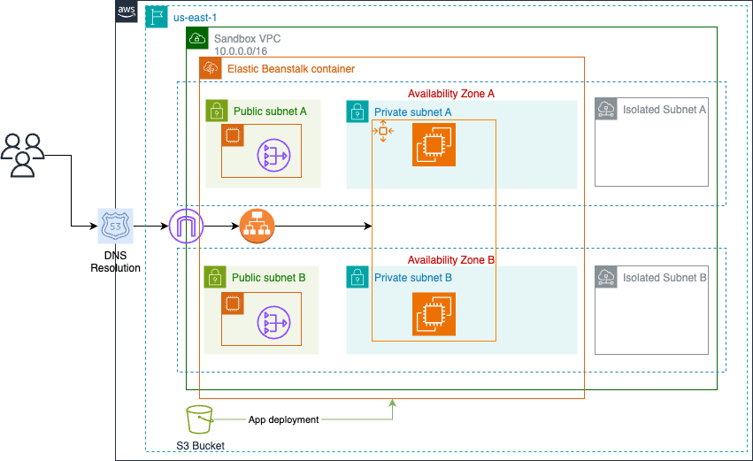

# Setup
In order to deploy project you will need the following tools:
* Node.js
* AWS CLI
* AWS credentials
#### Step 1 - Verify environment
You can check if your environment is ready with `make check`
#### Step 2 - Install Node.js dependencies
Code is written in TypeScript, so you have to install modules with `make install`
#### Step 3 - Prepare AWS environment
In order to perform deployments additional resources have to be created in AWS with `make bootstrap`
# Deployments
Code that describes infrastructure resides within `cloud/` forder so navigate to that folder for deployments
## Infrastructure
In order to create resources from preview two stacks have to be deployed
By design this stack should include shared resources (e.g. used by other stacks). Default verson includes VPC and resources required for it to function.
#### Stack - Prototype
This stack is CodeDeploy envrironmnet where app will be deployed as well as other resources (such as roles) required for it to function.

You can view list of resources with `npm run cdk diff Prototype`. In order to create resourses in AWS run `npm run cdk deploy Prototype` and confirm roles/permissions change.
## Application
In order to deploy current application version to the AWS run:
1. `bin/upload`
2. `bin/deploy <revision_path_from_previous_command>`
# Cleanup
After you're done *always* delete resources in the following order
```
npm run cdk destroy Prototype
```
